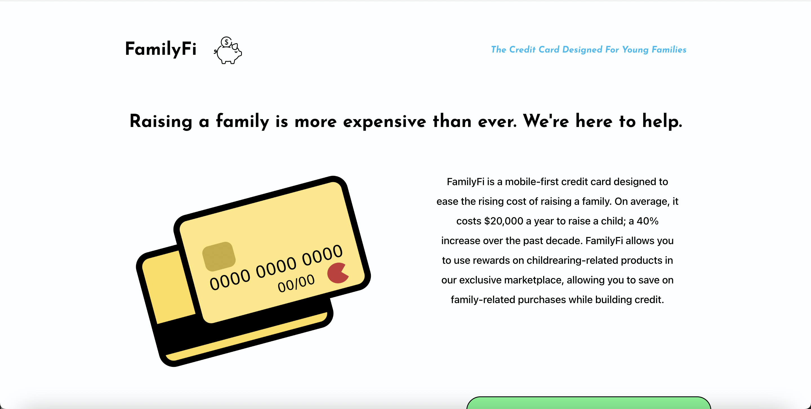
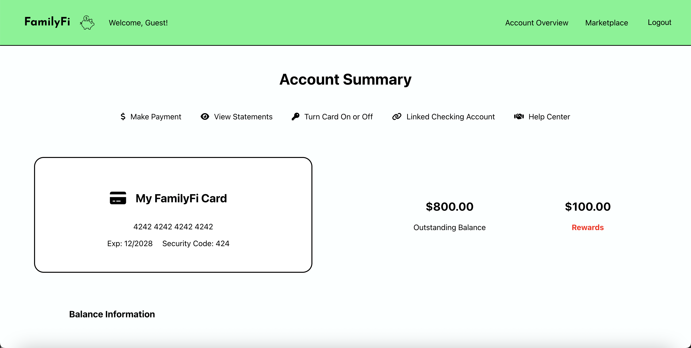
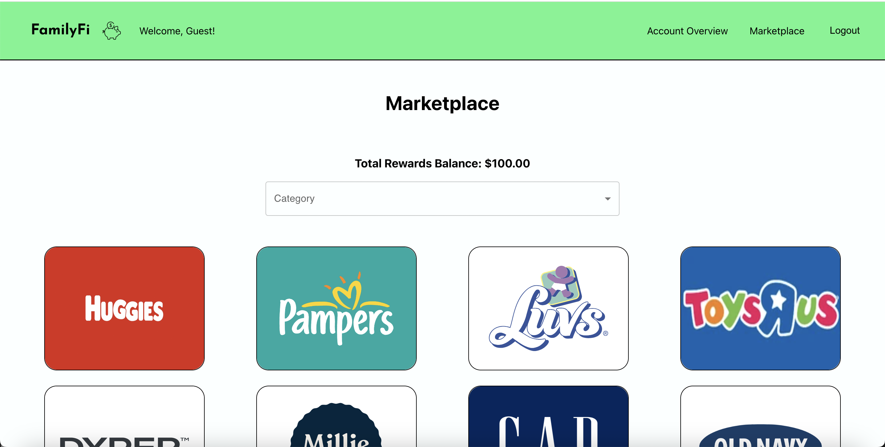

# FamilyFi

https://familyfi.vercel.app/

## Summary

This is a proof of concept for a credit card company idea and corresponding marketplace, both of which would be designed for young families. The demo email address is 'demo@familyfi.com' and the password is 'Password!1'.

## Scripts

`npm start` -- Runs the app in the development mode.
Open [http://localhost:3000](http://localhost:3000) to view it in your browser.

`npm test` -- Launches the test runner in the interactive watch mode.

## Screenshots

## Built With: 

React.js

TypeScript

Material UI

Styled Components

